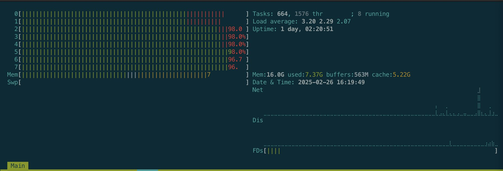

# Retail transactions




How much difference does parallel computing make over serial when processing a CSV file ?

The python script in this repo runs on a fictional retail sales CSV file (1 million rows) located in the datasets folder. It uses pandas to store the data then does an arbitrary operation on the dataframe line by line ("calculates discount"). Given the data is already in a dataframe vectorized calculation would be way quicker but would defeat the point of the exercise. How much quicker ? I don't know I might do the test another time.

As per the help flag the mode and chunksize can be set:

```
> python process_transactions.py --help
usage: process_transactions.py [-h] [--chunksize CHUNKSIZE] [--mode {serial,parallel}]

Process retail transactions serially or in parallel.

options:
  -h, --help            show this help message and exit
  --chunksize CHUNKSIZE
                        Chunksize for parallel processing (default: 25000)
  --mode {serial,parallel}
                        Run mode: 'serial' or 'parallel' (default: parallel)
```

The defaults are optimal (parallel mode, 25,000 chunk size)

On a 2020 Mac M1 with 2 e-cores and 6 p-cores:

-  without chunking (ie a chunksize of 1,000,000) parallel computing is about 3 seconds slower than serial (~19s vs ~16s)
-  parallel computing improved with decreasing chunk size down to a chunk size of somewhere between 75,000 and 25,000
-  At a chunk size of 25,000 parallel computing processing time is ~4 seconds (ie a 75% improvement on serial computing)  

https://media.licdn.com/dms/image/v2/D5622AQHiKuw2lIPPbw/feedshare-shrink_2048_1536/B56ZVBWW9jGoAo-/0/1740558137156?e=1752105600&v=beta&t=_rQmWFxLr2SrotyGTKl9SdFpcedBgwVBbpYv8z58ABU


